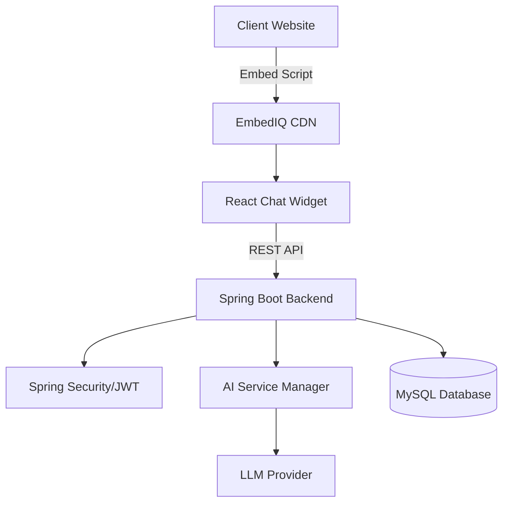

# 🚀 EmbedIQ — AI Chatbot SaaS Platform

<div align="center">


**Turn static websites into interactive AI-driven experiences with a single line of code.**

[🌐 Visit Official Website](https://www.embediq.in)

</div>

---

## 🌟 Overview
EmbedIQ is a scalable SaaS platform that enables businesses to create, train, and deploy custom AI chatbots. Users can upload their own business knowledge and embed a fully functional, branded chat widget onto any website using a simple CDN script.

---

## ✨ Features
- **Zero-Code Deployment:** Copy-paste a `<script>` tag to any website.
- **Knowledge Training:** Train bots on custom text data for context-aware responses.
- **UI Customization:** Adjust widget colors, icons, and positioning in real-time.
- **SaaS Architecture:** Secure multi-tenant system with subscription-based limits.
- **Chat Analytics:** Track user interactions and bot performance.
- **Verified Emails:** Integrated with **Resend** for transactional and welcome emails.

---

## 🏗️ System Architecture



## 🌍 Experience the Magic (Live Demos)

Want to see how **EmbedIQ** adapts to different business needs? Explore our live demo environments below. Each site shows a unique bot personality and UI theme integrated with a single line of code.

<table border="0">
  <tr>
    <td width="50%" valign="top">
      <h3>🏥 CarePlus Medical</h3>
      <p><i>Industry: Healthcare & Wellness</i></p>
      <ul>
        <li><b>Bot Goal:</b> Patient FAQ & Triage</li>
        <li><b>Theme:</b> Clean, Medical Blue</li>
        <li><b>Feature:</b> Automated appointment guidance</li>
      </ul>
      <a href="https://careplluss.netlify.app/"><b>👉 Launch Healthcare Demo</b></a>
    </td>
    <td width="50%" valign="top">
      <h3>🧁 Steady Cupcake</h3>
      <p><i>Industry: E-commerce & Retail</i></p>
      <ul>
        <li><b>Bot Goal:</b> Sales & Order Tracking</li>
        <li><b>Theme:</b> Playful, Bakery Pink</li>
        <li><b>Feature:</b> Product recommendations</li>
      </ul>
      <a href="https://steady-cupcake-ecf7c7.netlify.app/"><b>👉 Launch Retail Demo</b></a>
    </td>
  </tr>
</table>

> [!TIP]
> **Try this:** Open a demo, ask a specific question like *"What are your delivery hours?"* or *"How do I book an appointment?"* and watch how the AI responds using the specific knowledge base of that business.

---

## 🛠️ Create Your Own Demo (3 Steps)

You can turn any website into a demo site in under 60 seconds:

1. **Configure:** Create a bot in the [EmbedIQ Dashboard](https://www.embediq.in).
2. **Train:** Paste your website URL or text knowledge into the training tab.
3. **Embed:** Copy the generated `<script>` tag and paste it into your HTML:

```html
<script 
  src="[https://cdn.embediq.in/widget.js](https://cdn.embediq.in/widget.js)" 
  data-bot-id="YOUR_BOT_ID" 
>
</script>
```
<p>code and ❤️ by sarthak.</p>